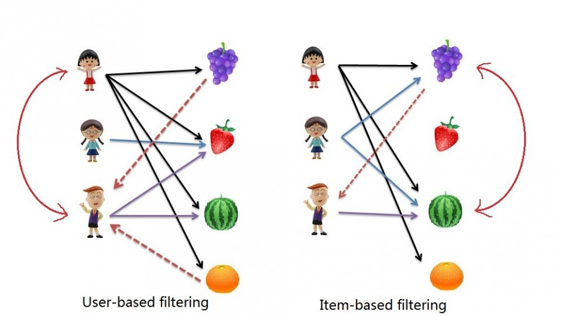
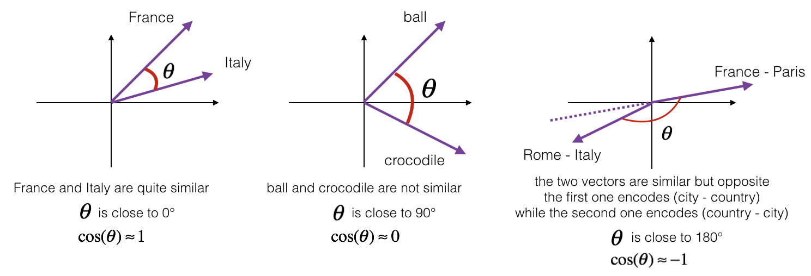

# Recommender Systems in Learning Applications

Recommender systems aren't anything new to us as our interaction with it has tremendously grown when we are involved with music/video streaming, online shopping or any webbrowsing-related behaviors. It might also be helpful if we have it applied in educational settings. Leveraging any data associated with a learner's behaviors and the patterns of all the fellow learners, recommender systems may be a good approach to provide him or her new content, insights or suggestions based on a comparison of the learner to his or her fellow learners. 

## Introduction to Tasks and Data Sets
In this project, I've built a basic recommender system in R as a scaffolding strategy to improve my learning experience with HUDK4051 (Intro to ML Methods): This recommender system will suggest which unit I should tackle next and which fellow students share interests with me. 

The two data sets that I worked with are *interest.csv* and *difficulty.csv* -- survey data of the perceived interest and difficulty ratings regarding the six units respectively, including:
* *pred*: prediction
* *sna*: social network analysis
* *nlp*: natural language processing
* *neural*: neural network
* *viz*: interactive visualization
* *loop*: loop closing

## Methods and Algorithms
### Collaborative Filters and Cosine Similarity

* User-based
Based on similarities of two users; working with the interest data to suggest which fellow students that match with me the most and I may find to be a good person to work with for the course. 
* Item-based
Calculating similarities of two items based on users' ratings of the items; providing a suggested next unit to a student who is looking for the unit that is most similar in terms of difficulty to a certain unit

* Cosine similarity
Cosine similarity was the measurement technique of similarity used when creating the both filters. By calculating the cosine of the angle between two users/items, we get to compare similarities/dissimilarities of each pair. As cosine similarity wasn't a good indicator of magnitude difference, centered cosine similarity was also used in my model where all the ratings were to be normalized by substracting the mean rating of the user. Hence, users' difference in scaling would also be taken into consideration.

* Principle component analysis (PCA)
It's important that we take into consideration both our interests and unit difficulty. PCA was introduced to create a composite measure from interest and difficulty. It a technique of integrating high-dimension data into fewer dimensions yet still captures most variance with the original data.

## Author
* [Qingying Zhou](https://www.linkedin.com/in/qingying-zhou/)

## Acknowledgements
This is a project of HUDK4051, instructed by Professor Charles Lang at Teachers' College, Columbia Columbia University.